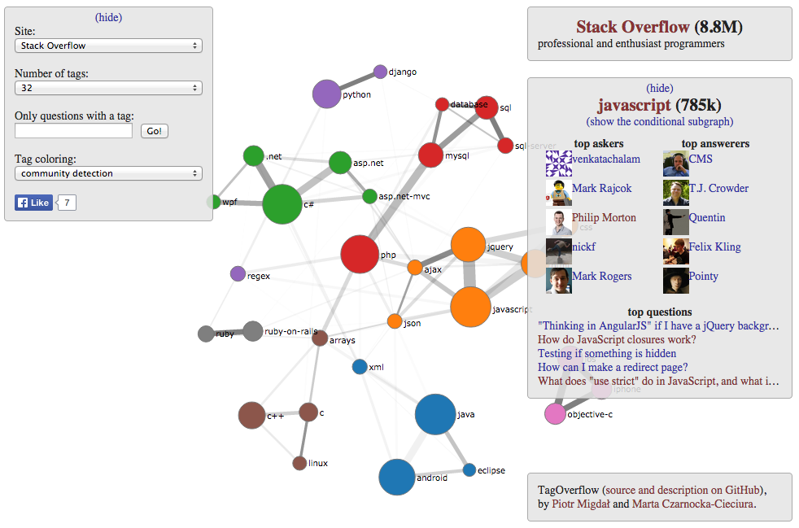

[TagOverflow](http://stared.github.io/tagoverflow/)
===========

An interactive map of tags from Stack Exchange sites.
[Click here for the live version!](http://stared.github.io/tagoverflow/)
As of now it looks more or less like:

## History

It is a continuation of my older project [Tag Graph Map of Stack Exchange](https://github.com/stared/tag-graph-map-of-stackexchange/wiki), which met with a warm reception of the Stack Exchange community (see e.g [here](http://meta.stackexchange.com/questions/157976/map-of-all-stack-exchange-sites-except-the-three-biggest) and [here](http://meta.math.stackexchange.com/questions/6479/a-graph-map-of-math-se); I even got t-shirts from the SE team!).

## Main ingredients

* [Stack Exchange](http://stackexchange.com/sites) (though [their wonderful API](https://api.stackexchange.com/docs))
* [D3.js](https://api.stackexchange.com/docs) with force layout
* A bit of stats
* Some [jQuery](http://jquery.com/), a [gist for gradients](https://gist.github.com/nowherenearithaca/4449376)
* A lot of procrastination on other projects ([which is a good thing](http://crastina.se/theres-no-projects-like-side-projects/))

## What's there?

Each question on Stack Exchange site has one to five tags describing its content. Unlike on Twitter, these tags are well curated (to a point, you can get a `taxonomist` badge). 

Nodes represent the most popular tags, with their area being proportional to the number of questions with them.

Edges represent relation between tags. Their width is related to the number of questions with both tags (e.g. with both `python` and `list`), while their shade - how much more often they occur than one should expect by random chance.
Default coloring is due to community detection - automated splitting of a graph into densely connected subgraphs.

You can click on a tag to get additional data, like users who have asked or answered a lot of questions, along with the best questions with this tag. (Who knows, maybe you are one of the to guys and gals?)

Moreover, especially for [Stack Overflow](http://stackoverflow.com/), which is a big place, you can draw conditional graphs. That is, consider only questions with a given tag (e.g. `javascript`). For example, it will count only those occurrences `array`, which happen to be with `javascript`.  This tag DO NOT appear for the same reason that the site name does not appear a tag.

## Methods and tricks

The co-occurrence weight (use for edge shade and strength) is calculated from the [observed to expected ratio](http://stats.stackexchange.com/questions/6047/does-this-quantity-related-to-independence-have-a-name/).
It goes as follows:

    oe_ratio =  (all_qustions_count * tag_count_AB) / (tag_count_A * tag_count_B)  

It is exactly `1` if and only if two tags co-appear at random. If it is more, it means that they do "like" each other I draw an edge. (I also ignore it when `oe_ratio` is less than one - i.e. when they avoid each other.) Believe me, this measure is much better than making correlations of some vectors (I tried).

The limit of 100 questions is because of the API limit. However, for dynamic graphs it is also a sane limit. But for most sites 32 tags should be well enough, except for a few sited that are bigger. 

In any case, it does a lot of queries and (from time to time) Stack Exchange may block you. Don't worry, it lasts only for a few minutes.

Positions of the nodes is due to [D3.js force layout](https://github.com/mbostock/d3/wiki/Force-Layout). That is, nodes connected via an edge attract each other. The strength of such attraction depends on the strength f an edge. Plus, all nodes repeal each other at a short distance to prevent overlaps.

For [community detection](http://digitalinterface.blogspot.it/2013/05/community-detection-in-graphs.html) I wrote a greedy hierarchical modularity maximization (as in [arXiv:cond-mat/0408187](http://arxiv.org/abs/cond-mat/0408187)). 
(AFAIK there is no other JavaScript implementation of community detection; if there is a need, I would be happy to implement something more serious like [Louvain](https://sites.google.com/site/findcommunities/) or [Infomap](http://www.mapequation.org/code.html). If you want it to happen, a few encouraging e-mails will work. :) EDIT: [there is a good implementation of Louvain in JS](https://github.com/upphiminn/jLouvain).) 

There are some tricks. For example, to calculate tag statistics (e.g. average number of answer per tag) it is unfeasible to probe all questions, and there is no REST API to get these numbers directly. So, it takes 100 newest questions with a given tag, which are at least a month old (so their scores stabilize a bit).

The best askers and answerers, unfortunately, do not work properly for conditional tags (as the respective API queries can be done only for a single tag).

As tag statistics (like average score) have long tails but also can be zero or negative, neither linear nor log scale fits. So, Marta built an [asinh](http://mathworld.wolfram.com/InverseHyperbolicSine.html) scale! In short, for small values it works as linear, but for large - as logarithm; and is antisymmetric. 

## On code quality

Before looking at code: beware, when you gaze long into a code the code also gazes into you!

(Some excuses: I started it long time ago, changed it in various directions, used to learn JS, teach JS - so it has most of bad practices it could get. I should rewrite it completely into Angular.JS + D3.js; but instead, I decided to show the result, hoping that you forgive me the dirty code.)

Nonetheless, if something does not work, raise an [Issue](https://github.com/stared/tagoverflow/issues) or (even better!) propose a Pull Request.

## Citing

Feel free to use it for anything. Just please to refer to it as:

* Piotr Migdał, Marta Czarnocka-Cieciura, TagOverflow (2015), GitHub repository https://github.com/stared/tagoverflow

And for any academic papers, please cite:

* Piotr Migdał, Symmetries and self-similarity of many-body wavefunctions, PhD Thesis (ICFO), [arXiv:1412.6796](http://arxiv.org/abs/1412.6796)
